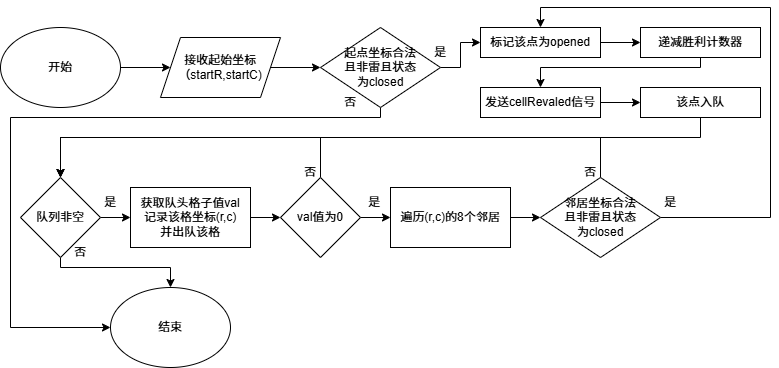
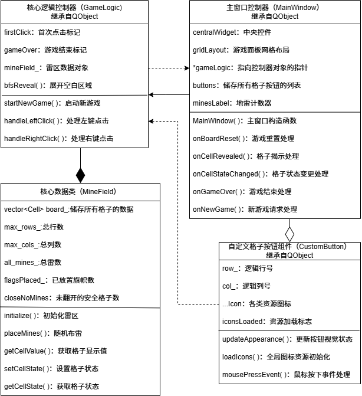

# 基于 C++11 和 Qt6 的扫雷游戏

> **课程设计报告** | 信息与电子工程学院 | 计算机科学与技术 | 2026年6月

---

## 一、设计时间

2026年6月29日 — 7月3日

## 二、环境与运行
- 编译器：MSVC 2019 / MinGW
- 构建工具：CMake 3.10+
- 依赖：Qt 6.x
- 运行：`mkdir build && cd build && cmake .. && make`

## 三、设计地点

■■■■■■■■

## 四、设计目的

1. 通过实践深化对数据结构知识的理解与掌握。
2. 结合 C++11 的特性与 Qt6 框架进行编程，提升编程技能；
3. 锻炼调试与异常处理能力；
4. 培养查阅资料，独立思考问题的能力；
5. 锻炼整体思维能力，提高系统集成能力；
6. 为今后参与更复杂的开发项目积累经验。

## 五、设计小组成员

> *（成员信息已移除）*

## 六、指导老师

> *（教师信息已移除）*

## 七、设计课题

遵循 MVC 架构，使用 Qt 信号槽机制实现数据与视图的解耦，依照功能需求对扫雷游戏项目进行模块划分。

项目实现经典 Windows 扫雷游戏规则：左键翻开格子，右键标记/切换旗帜/问号，首次点击必定为空白格，数字显示周围雷数，空白区域自动展开。

项目支持三种预设难度：初级（9×9，10雷），中级（16×16，40雷），高级（16×30，99雷）和自定义难度。提供可视化图形界面，使用图标表示不同状态，游戏结束后显示获胜/失败提示。

采用业务逻辑与界面渲染完全分离的设计，便于测试、扩展和维护。

## 八、基本思路及关键问题的解决方法

### 数据结构设计

1. 使用一维向量存储所有格子，通过索引映射函数完成坐标到索引的转换；
2. 采用结构体包装格子参数：是否为地雷，周围地雷数，当前状态；
3. 使用队列存放待展开的格子坐标，非递归 BFS 遍历空白区域，避免递归栈溢出。

### 关键算法

1. **随机布雷**：将首次点击位置及其 3×3 邻域从可布雷格子索引列表中踢出，使用 `shuffle` 函数打乱索引列表顺序，取前 `mines` 个作为雷区；时间复杂度 O(rows×cols)，空间复杂度 O(rows×cols)。

2. **邻域雷数计算**：双层循环遍历每个非雷格子，检查其 3×3 邻域，统计地雷个数，存入 `roundMines`；时间复杂度 O(9×n)，n 为总格数。

3. **空白区域 BFS 展开**：从点击点开始，若该格子值为 0，则将其入队，并在入队前立即标记为 `opened`，防止重复入队。循环出队时，检查其 8 个邻居，若邻居状态为 `closed` 且值为 0，则将其标记为 `opened` 并入队。算法保证每个格子最多入队一次，时间复杂度 O(n)，空间复杂度 O(n)。

4. **胜负判定**：设置 `hiddenNonMine` 计数器，每次翻开安全格子时递减，当计数器归零时判定胜利。在点到地雷时触发失败判定，通过信号通知视图层显示所有地雷。

### 数据解耦与事件驱动

使用 Qt 信号槽，`CustomButton` 发出 `leftClicked`、`rightClicked` 信号，`GameLogic` 响应并修改 `MineField`，再通过 `cellRevealed`、`cellStateChanged` 等信号通知 `MainWindow` 更新 UI 显示。

## 九、算法及流程图

### 1、BFS 空白区域展开算法

```cpp
void GameLogic::bfsReveal(int startRow, int startCol) {
    // 判断起点合法性与状态
    if (!mineField_.inBounds(startRow, startCol) ||
        mineField_.getCellState(startRow, startCol) != closed)
        return;

    std::queue<std::pair<int, int>> que;
    // 起点入队前立即标记为opened（避免重复入队）
    mineField_.setCellState(startRow, startCol, opened);
    mineField_.decrementHiddenNonMine();  // 递减胜利条件计数器
    emit cellRevealed(startRow, startCol,
                      mineField_.getCellValue(startRow, startCol));  // 通知揭开该格
    que.push({startRow, startCol});

    while (!que.empty()) {  // BFS主循环，当队空时终止
        auto [r, c] = que.front();  // 获取队头格子坐标
        que.pop();
        int val = mineField_.getCellValue(r, c);  // 获取该格的值

        if (val == 0) {  // 如果该格为空白，展开邻居
            for (int dr = -1; dr <= 1; ++dr) {
                for (int dc = -1; dc <= 1; ++dc) {
                    if (dr == 0 && dc == 0) continue;  // 跳过中心格
                    int nr = r + dr, nc = c + dc;  // 邻居坐标
                    if (mineField_.inBounds(nr, nc) &&
                        mineField_.getCellState(nr, nc) == closed &&
                        !mineField_.isMine(nr, nc)) {
                        // 入队前立即标记opened（防重复入队）
                        mineField_.setCellState(nr, nc, opened);
                        mineField_.decrementHiddenNonMine();
                        emit cellRevealed(nr, nc,
                            mineField_.getCellValue(nr, nc));  // 通知揭开该格
                        que.push({nr, nc});
                    }
                }
            }
        }
    }
}
```



### 2、项目类图



## 十、调试过程中出现的问题及相应解决办法

### 1、运行后窗口闪现即关闭，点击格子后卡顿崩溃（退出代码 0xC0000005：内存访问违规）

**原因**：在 `MainWindow::rebuildButtons()` 中，先调用了 `buttons.resize(rows*cols)` 创建了空指针列表，再使用 `buttons.append(btn)` 追加新按钮，导致列表前半部分为 `nullptr`，后半部分为有效对象，`onCellRevealed` 通过索引访问到空指针，触发崩溃。

**解决方法**：删除 `resize()` 调用，只使用 `append()` 动态添加，确保 `buttons[i]` 与第 `i` 个格子一一对应。

### 2、格子图标（数字、旗帜等）完全不显示，按钮只显示空白背景

**原因**：`.qrc` 资源文件前缀为 `/images`，但文件标签内包含 `images/` 子目录，导致实际资源路径为 `:/images/images/num1.png`，而代码中使用 `/images/num1.png`，导致路径不匹配。

**解决方法**：将 `.qrc` 前缀改为 `/`，使资源路径为 `:/images/num1.png`。

### 3、踩雷时被踩的雷图标不显示，踩中的格子变为空白

**原因**：`GameLogic` 踩雷时设置了状态为 `detonate` 并发送 `cellRevealed(..., value=-1)`，但 `MainWindow::onCellRevealed` 统一使用 `opened` 状态更新按钮外观，覆盖了 `detonate` 状态。

**解决方法**：在 `onCellRevealed` 中根据 `value` 值判断，若为 `-1` 则调用 `updateAppearance(detonate, -1)`，否则使用 `opened`。

### 4、难度从初级切换至高级，网格变多但窗口大小未改变，部分按钮被隐藏或挤压

**原因**：构造函数中设置了 `setMinimumSize(320, 350)`，且重建网格后未调用窗口自适应方法。

**解决方法**：删除固定最小尺寸，在 `rebuildButtons()` 末尾调用 `centralWidget->adjustSize()` 和 `adjustSize()`，让布局自动计算最佳尺寸。

## 十一、课程设计心得体会

概括来说，本次数据结构课程设计让我收获颇丰。

在课本上学习到的队列、数组、BFS 算法等知识，在实现扫雷游戏时得到了真实场景的检验。我深刻体会到理论与实践的结合在学习与研究上的重要性。

面对 0xC0000005 这类底层内存错误，我学会了使用调试器逐步跟踪、打印关键变量、分析资源加载路径等排查方法，并最终发现问题所在是 `resize()` 和 `append()` 混用。小细节导致的严重错误让我意识到在编程时必须注重严谨，注重数据结构和容器操作的每一个细节。相应的，这次经历让我不再惧怕 Bug 的存在，而是将其视为学习的机会，用以锻炼自己的代码维护能力。

在后期扩展功能（自定义难度、重置游戏）时，MVC 架构让我能够快速修改，而不必重写整个项目。信号槽机制使得模块间通信清晰且安全，这让我对"高内聚、低耦合"这一基本原则有了切身感受，并深切体会到了模块化的强大。

虽然这次是个人项目，但我参考了多种开源实现和文档，让我学会了查阅资料、借鉴他人经验，并独立解决问题，这在一定程度上培养了我的团队协作的意识。

## 十二、源程序

### 主窗口控制器（MainWindow）

**内部接口：**

```cpp
void startGame(int rows, int cols, int mines);  // 启动新游戏
void rebuildButtons();  // 重建按钮网格
void clearButtons();  // 清理现有按钮
```

**外部接口：**

```cpp
explicit MainWindow(QWidget *parent = nullptr);  // 主窗口构造
~MainWindow();  // 析构函数
```

**内部槽：**

```cpp
void onBoardReset();  // 游戏重置处理槽
void onCellRevealed(int row, int col, int value);  // 格子揭示处理槽
void onCellStateChanged(int row, int col, CellState state);  // 格子状态变更处理槽
void onRemainingFlagsChanged(int remaining);  // 剩余旗帜计数更新槽
void onGameOver(bool win);  // 游戏结束处理槽
void onNewGame();  // 新游戏请求槽
void onBeginner();  // 初级难度槽
void onIntermediate();  // 中级难度槽
void onExpert();  // 高级难度槽
void onCustomGame();  // 自定义难度槽
```

### 核心逻辑控制器（GameLogic）

**内部接口：**

```cpp
void revealCell(int row, int col);  // 揭开单个格子
void bfsReveal(int startRow, int startCol);  // 广度优先搜索展开
void checkWin();  // 胜利条件检查
void revealAllMines();  // 揭开所有地雷
```

**外部接口：**

```cpp
explicit GameLogic(QObject *parent = nullptr);  // 构造函数
void startNewGame(int rows, int cols, int mines);  // 启动新游戏
void handleLeftClick(int row, int col);  // 处理鼠标左键点击事件
void handleRightClick(int row, int col);  // 处理鼠标右键点击事件
int rows() const;  // 获取当前雷区行数
int cols() const;  // 获取当前雷区列数
```

**信号：**

```cpp
void cellRevealed(int row, int col, int value);  // 格子翻开信号
void cellStateChanged(int row, int col, CellState state);  // 格子状态变更信号
void gameOver(bool win);  // 游戏结束信号
void remainingFlagsChanged(int remaining);  // 剩余旗帜计数变更信号
void boardReset();  // 雷区重置信号
```

### 雷区数据管理类（MineField）

**内部接口：**

```cpp
int index(int row, int col);  // 坐标索引映射
```

**外部接口：**

```cpp
MineField();  // 默认构造函数
void initialize(int rows, int cols, int mines);  // 初始化雷区
void placeMines(int excludeRow, int excludeCol);  // 布雷
void calculateNumbers();  // 计算所有非雷格子周围的雷数量
int adjacentMines(int row, int col) const;  // 获取指定格子周围8个相邻格子中的雷数量
bool isMine(int row, int col) const;  // 检查指定格子是否为雷
bool inBounds(int row, int col) const;  // 检查坐标是否在雷区内
int getRows() const;  // 获取雷区总行数
int getCols() const;  // 获取雷区总列数
int getMines() const;  // 获取实际布置的雷总数
int getCellValue(int row, int col) const;  // 获取格子的显示值
CellState getCellState(int row, int col) const;  // 获取格子的当前状态
void setCellState(int row, int col, CellState state);  // 设置格子的状态
int hiddenNonMineCount() const;  // 获取剩余需要翻开的安全格子数量
void decrementHiddenNonMine();  // 减少剩余安全格子计数
int flagsPlaced() const;  // 获取当前已放置的旗帜总数
void incrementFlags();  // 增加旗帜计数
void decrementFlags();  // 减少旗帜计数
```

### 自定义格子按钮组件

**外部接口：**

```cpp
explicit CustomButton(int row, int col, QWidget *parent = nullptr);  // 构造函数
void updateAppearance(CellState state, int value);  // 更新按钮视觉状态
static void loadIcons();  // 全局图标资源初始化
```

**信号：**

```cpp
void leftClicked(int row, int col);  // 左键点击事件信号
void rightClicked(int row, int col);  // 右键点击事件信号
```

**事件响应：**

```cpp
void mousePressEvent(QMouseEvent *event) override;  // 鼠标按下事件处理器
```

## 参考文献

[1] 李冬梅，严蔚敏，吴伟民. 数据结构（C语言版 第3版）. 北京：人民邮电出版社，2024.

[2] Qt 官方文档：https://doc.qt.ac.cn/

[3] 扫雷游戏. 力扣：https://leetcode.cn/problems/minesweeper/description/


